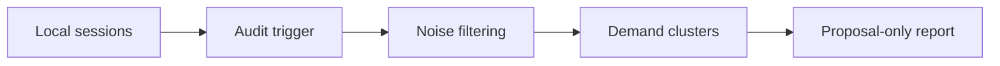

# Conversation Skill Auditor Skill

Portable audit skill for scanning local Codex and Claude CLI conversation history to detect unmet-skill demand and tier-review evidence.

## Who This Is For

| Use this when you... | Use something else when you... |
| --- | --- |
| need read-only evidence from local AI session history | only need to summarize the current thread |
| want to decide whether to create or update a skill | already decided to edit a specific skill package |
| need L2/L3 tier review signals from repeated demand | need to review a document with no conversation-history dependency |

## Why This Exists

- Turns noisy session history into proposal-only skill signals.
- Separates demand discovery from direct skill editing.
- Keeps local history workflows read-only by default.

## What Ships

| Component | Role |
| --- | --- |
| [`conversation-skill-auditor`](./conversation-skill-auditor) | installable Codex App skill package |
| [`conversation-skill-auditor/references`](./conversation-skill-auditor/references) | bundled public reference material |
| [`conversation-skill-auditor/scripts`](./conversation-skill-auditor/scripts) | bundled helper scripts |
| [`conversation-skill-auditor/test-prompts.json`](./conversation-skill-auditor/test-prompts.json) | trigger and non-trigger examples |
| [`CHANGELOG.md`](./CHANGELOG.md) | release history |
| [`LICENSE`](./LICENSE) | license |

## Install / Use

### Codex App

- Install the skill from this repo path: `conversation-skill-auditor`
- GitHub install target:
  - repo: `Mingdao007/conversation-skill-auditor-skill`
  - path: `conversation-skill-auditor`
- Restart `Codex App` after installation so the new skill is discovered.

## Workflow

## Coverage

- read-only auditing of supported local Codex and Claude CLI history sources
- noise filtering before theme counting and recommendation generation
- weak versus actionable candidate output for genuinely unmet skill requests

## Expected Result / Verification

| Check | Expected result |
| --- | --- |
| Install target | `conversation-skill-auditor` |
| GitHub target | `Mingdao007/conversation-skill-auditor-skill` with path `conversation-skill-auditor` |
| Skill entrypoint | `conversation-skill-auditor/SKILL.md` exists |
| Trigger examples | `conversation-skill-auditor/test-prompts.json` |
| Privacy check | public package contains no private local paths or live user state |

## Trigger Examples

- `Audit my local AI session history for missing skills.`
- `Check whether repeated requests justify a new skill.`
- `Inspect local Codex and Claude CLI sessions for unmet capability patterns.`

## Non-Trigger Examples

- `Summarize only this one current thread.`
- `Directly edit an existing skill package.`
- `Review a document that does not depend on local history.`

## Privacy Boundary

This public repository keeps the workflow generic and reusable.

- The published workflow stays read-only and generic to local history sources.
- Personal path references and startup-prompt noise labels are rewritten into host-generic wording.

## Repository Layout

| Path | Purpose |
| --- | --- |
| [`conversation-skill-auditor`](./conversation-skill-auditor) | installable Codex App skill package |
| [`conversation-skill-auditor/references`](./conversation-skill-auditor/references) | bundled public reference material |
| [`conversation-skill-auditor/scripts`](./conversation-skill-auditor/scripts) | bundled helper scripts |
| [`conversation-skill-auditor/test-prompts.json`](./conversation-skill-auditor/test-prompts.json) | trigger and non-trigger examples |
| [`CHANGELOG.md`](./CHANGELOG.md) | release history |
| [`LICENSE`](./LICENSE) | license |

Chinese:

- [README.zh-CN.md](./README.zh-CN.md)
