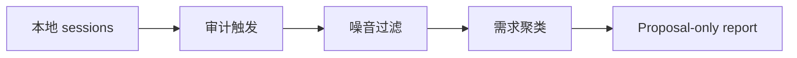

# Conversation Skill Auditor Skill

可移植的对话审计 skill，用于扫描本地 Codex 和 Claude CLI 历史，发现未满足的 skill 需求和 tier review 证据。

## 适合谁

| 适合使用 | 不适合使用 |
| --- | --- |
| 需要从本地 AI session history 中读取只读证据 | 只需要总结当前 thread |
| 想判断是否应该创建或更新 skill | 已经决定直接编辑某个 skill package |
| 需要从重复需求中判断 L2/L3 tier 是否要 review | 要 review 的文档不依赖 conversation history |

## 为什么需要它

- 把嘈杂 session history 转成 proposal-only skill signal。
- 把需求发现和直接编辑 skill 分开。
- 默认保持本地历史读取为 read-only。

## 包含内容

| Component | 作用 |
| --- | --- |
| [`conversation-skill-auditor`](./conversation-skill-auditor) | 可安装的 Codex App skill package |
| [`conversation-skill-auditor/references`](./conversation-skill-auditor/references) | 随包发布的公开 reference material |
| [`conversation-skill-auditor/scripts`](./conversation-skill-auditor/scripts) | 随包发布的 helper scripts |
| [`conversation-skill-auditor/test-prompts.json`](./conversation-skill-auditor/test-prompts.json) | trigger / non-trigger 示例 |
| [`CHANGELOG.md`](./CHANGELOG.md) | release history |
| [`LICENSE`](./LICENSE) | license |

## 安装 / 使用

### Codex App

- 从本 repo 的这个路径安装 skill：`conversation-skill-auditor`
- GitHub install target:
  - repo: `Mingdao007/conversation-skill-auditor-skill`
  - path: `conversation-skill-auditor`
- 安装后重启 `Codex App`，让新 skill 被重新发现。

## 工作流

## 覆盖范围

- 只读审计支持的本地 Codex 和 Claude CLI 历史来源
- 在 theme counting 和 recommendation 前过滤噪音
- 区分 weak candidate 与 actionable unmet-skill request

## 预期结果 / 验证

| 检查项 | 预期结果 |
| --- | --- |
| 安装路径 | `conversation-skill-auditor` |
| GitHub target | `Mingdao007/conversation-skill-auditor-skill`，path 为 `conversation-skill-auditor` |
| Skill 入口 | 存在 `conversation-skill-auditor/SKILL.md` |
| 触发样例 | `conversation-skill-auditor/test-prompts.json` |
| 隐私检查 | 公开包不包含私人本机路径或 live user state |

## 触发示例

- `Audit my local AI session history for missing skills.`
- `Check whether repeated requests justify a new skill.`
- `Inspect local Codex and Claude CLI sessions for unmet capability patterns.`

## 不应触发

- `Summarize only this one current thread.`
- `Directly edit an existing skill package.`
- `Review a document that does not depend on local history.`

## 隐私边界

这个公开仓库只保留通用、可复用的 workflow。

- 公开 workflow 对本地历史来源保持 read-only 和通用化。
- personal path 和 startup-prompt noise label 已改写成 host-generic 表述。

## 仓库结构

| 路径 | 作用 |
| --- | --- |
| [`conversation-skill-auditor`](./conversation-skill-auditor) | 可安装的 Codex App skill package |
| [`conversation-skill-auditor/references`](./conversation-skill-auditor/references) | 随包发布的公开 reference material |
| [`conversation-skill-auditor/scripts`](./conversation-skill-auditor/scripts) | 随包发布的 helper scripts |
| [`conversation-skill-auditor/test-prompts.json`](./conversation-skill-auditor/test-prompts.json) | trigger / non-trigger 示例 |
| [`CHANGELOG.md`](./CHANGELOG.md) | release history |
| [`LICENSE`](./LICENSE) | license |

English:

- [README.md](./README.md)
